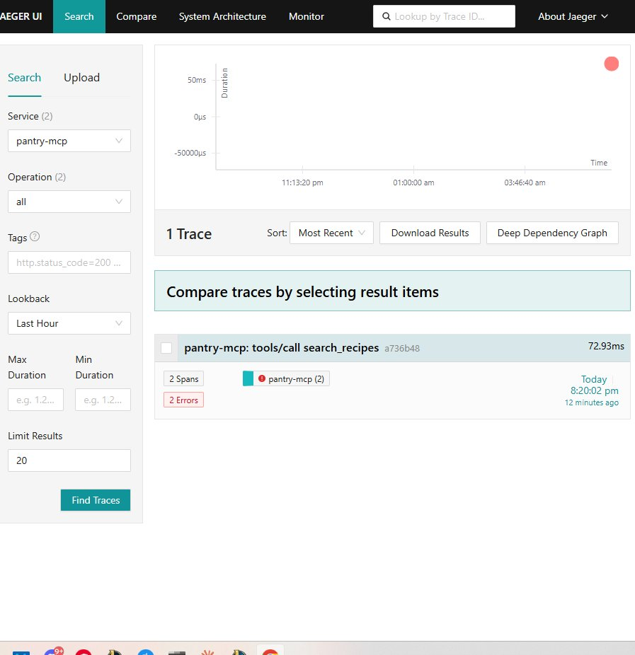

# claude-mcp-server-template

> Production-survival MCP server template — for servers that don't die in production.

[](https://github.com/alexisgarcia-dev/claude-mcp-server-template/actions)
[](https://github.com/alexisgarcia-dev/claude-mcp-server-template/actions)
[](https://modelcontextprotocol.io/specification/2025-11-25)
[](https://www.python.org/downloads/)
[](https://gofastmcp.com)
[](LICENSE)



A Python MCP server template built around the patterns that distinguish 9% healthy from 52% dead MCP servers in production (April 2026 community scan, 2,181 endpoints).

## Why this template

Most MCP server templates ship the spec primitives. This one ships the production-survival foundation:

1. **Streamable HTTP transport** — mandatory for remote deployment per 2026 spec, not stdio
2. **Bearer token authentication** — `StaticTokenVerifier` for preview, migration path to `JWTVerifier` documented
3. **OpenTelemetry observability** — OTLP exporter wired in `lifespan`, MCP semantic conventions
4. **Pinned dependencies + `uv.lock`** — reproducible across dev, staging, production
5. **JSON-RPC healthcheck** — Docker `HEALTHCHECK` runs an authenticated `tools/list` JSON-RPC call validating bearer auth + Streamable HTTP transport + tool registration in one shot. Catches misconfig and protocol failure, not just process crash. (Upstream API connectivity validation is a future direction — see [ROADMAP.md](./ROADMAP.md).)

If `git clone && docker compose up && curl` doesn't work on a fresh machine, this template has failed its primary contract.

## Quickstart

```bash
git clone https://github.com/alexisgarcia-dev/claude-mcp-server-template.git
cd claude-mcp-server-template
docker compose up -d
```

The server is reachable at `http://localhost:8000/mcp` with Streamable HTTP transport. Bearer auth: `demo-readonly` (read access) or `demo-readwrite` (write).

List available tools using the FastMCP Python client:

```python
from fastmcp import Client
import asyncio

async def main():
    async with Client(
        "http://127.0.0.1:8000/mcp",
        headers={"Authorization": "Bearer demo-readonly"},
    ) as client:
        tools = await client.list_tools()
        for t in tools:
            print(f"  {t.name}: {t.description}")

asyncio.run(main())
```

OpenTelemetry traces visible at `http://localhost:16686` (Jaeger UI).

**Manual HTTP protocol note** — MCP Streamable HTTP transport requires a 2-step handshake (`initialize` → capture `Mcp-Session-Id` response header → `tools/list` with that session ID). The fastmcp Client SDK handles this transparently. For raw `curl` / PowerShell usage, see [docs/manual-http-handshake.md](./docs/manual-http-handshake.md).

## What's inside

| Primitive | Count | Notes |
|---|---|---|
| Tools | 4 | `get_recipe`, `search_recipes`, `update_pantry`, `generate_meal_plan` (async with progress) |
| Resources | 1 | `recipe_resource` (MIME-typed) |
| Prompts | 1 | `weekly_planner` (role-restricted per MCP 1.27) |

The demo wraps a fake SaaS (`PantryAPI`, included as `pantry_mock_api.py`) so you can see end-to-end wiring without external accounts.

## Authentication

> **⚠ DO NOT deploy with default `demo-readonly` / `demo-readwrite` tokens.** They are committed to source for preview/dev parity (CI smoke tests, Claude Desktop demos). Production deployments require OAuth 2.1 + PKCE — see [ROADMAP.md](./ROADMAP.md) Future directions.

`v0.1.0` ships `StaticTokenVerifier` with two demo tokens:

```python
from fastmcp.server.auth.providers.jwt import StaticTokenVerifier

verifier = StaticTokenVerifier(
    tokens={
        "demo-readonly":  {"client_id": "ro", "scopes": ["read:pantry"]},
        "demo-readwrite": {"client_id": "rw", "scopes": ["read:pantry", "write:pantry"]},
    },
    required_scopes=["read:pantry"],
)
```

This is **preview/dev authentication**. For internet-exposed production deployments, wait for `v0.2.0` or use behind a gateway.

`v0.2.0` will ship full OAuth 2.1 + PKCE with reference integrations for Auth0, WorkOS, and Azure Entra ID. Migration is a one-line change (`StaticTokenVerifier` → `JWTVerifier(jwks_uri=..., issuer=..., audience=...)`).

See [ROADMAP.md](ROADMAP.md) for the full versioning plan.

## Customizing for your API

Replace `PantryAPI` with your own:

1. Update `src/config.py` with your API base URL, auth, timeouts
2. Replace tool implementations in `src/tools/` with calls to your API
3. Update healthcheck in `src/server.py` `/ready` endpoint to ping your upstream

The retry logic (`tenacity AsyncRetrying`), secret masking (`SecretStr`), and OTel masking hooks are configured once in `src/pantry_client.py` and reused.

## Dry-run mode (v1.1.0)

Demo the server end-to-end against any MCP client (Claude Desktop, Cursor, Windsurf) **without** standing up the real backend. When `PANTRY_API__DRY_RUN=true`, every outbound HTTP request is short-circuited at the `PantryClient` chokepoint, returns a generic mock dict, and emits the would-be request as an OpenTelemetry event — sensitive headers (`Authorization`, `Cookie`, `X-Api-Key`, ...) are redacted by default. GDPR-safe, OTel-native, opt-in.

```bash
export PANTRY_API__DRY_RUN=true
uv run server
# Then trigger any Tool from your MCP client and inspect the captured
# payload in Jaeger (http://localhost:16686) under the "pantry.dry_run" span.
```

See [docs/dry-run.md](docs/dry-run.md) for the full reference (vertical use cases for POD / RAG / scrapers, configuration table, telemetry contract, security model).

## Stack

- Python 3.14
- [`uv`](https://docs.astral.sh/uv/) for dependency management
- [`mcp`](https://pypi.org/project/mcp/) 1.27 official SDK
- [`fastmcp`](https://gofastmcp.com) 3.2 framework
- `pytest`, `ruff`, `mypy` for the test/lint/type pipeline
- Docker compose with Jaeger for local observability

Exact pins in `pyproject.toml` and `uv.lock`.

## Tests

```bash
uv run pytest -q
```

48 tests passing (last run J14, 2026-05-08).

## Roadmap

See [ROADMAP.md](ROADMAP.md) for v0.2 → v0.5 trajectory.

**v1.0.0** is the stable reference release. See [ROADMAP.md](./ROADMAP.md) for community-driven future directions.

## Versioning policy

This release is `v1.0.0` — a **stable reference for the current MCP spec (2025-11-25) and FastMCP 3.2.x line**. It is frozen-by-design: maintenance is community-driven from this point forward (see [ROADMAP.md](./ROADMAP.md)).

**What "frozen-by-design" means here**:
- The five production-survival pillars and the demo PantryAPI integration are validated end-to-end against pinned versions (Python 3.11+ / `mcp` 1.27.0 / `fastmcp` 3.2.4 / Jaeger 1.62.0).
- A future `v1.1.x` line is contemplated **only if** the MCP specification evolves with breaking changes or FastMCP ships a 4.x line with non-trivial migration. See [ROADMAP.md](./ROADMAP.md) for the conditions.
- Bug fixes and security patches against `v1.0.x` will be accepted as community PRs and shipped as `v1.0.1`, `v1.0.2`, etc., on a best-effort basis.

**What this is NOT**:
- A commitment to track every FastMCP release indefinitely.
- A claim that this template is the right starting point for multi-tenant gateway deployments — see the "Out of scope by design" section of [ROADMAP.md](./ROADMAP.md) for honest scope limits.

## License

MIT — see [LICENSE](LICENSE).

## Contributing

Issues with the label `roadmap` carry weight. Real production feedback over speculative features.
